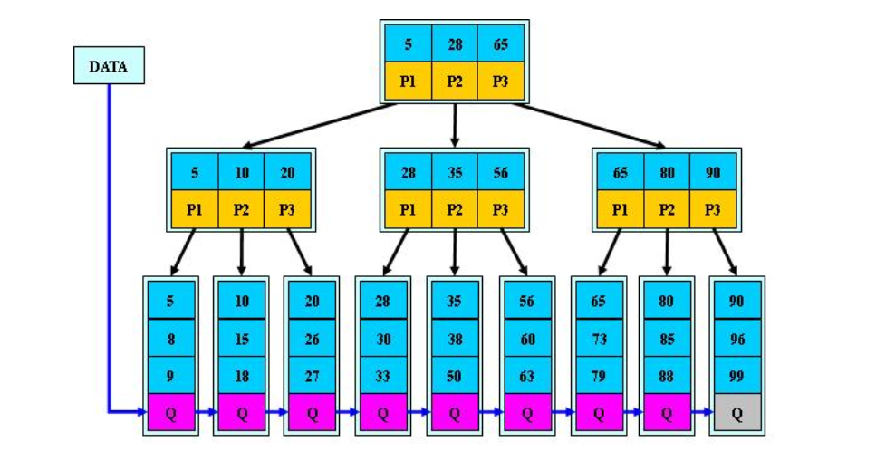

<!-- TOC -->

- [搜索树](#搜索树)
    - [大纲总结](#大纲总结)
    - [AVL树&RB树](#avl树rb树)
        - [AVL树](#avl树)
            - [AVL树的实现思路](#avl树的实现思路)
            - [旋转图解](#旋转图解)
                - [单旋](#单旋)
                - [双旋](#双旋)
        - [RB树](#rb树)
    - [B树&B+树](#b树b树)
        - [B-树](#b-树)
        - [B+树](#b树)
        - [B*树](#b树)
    - [字典树](#字典树)

<!-- /TOC -->

# 搜索树

## 大纲总结

搜素树就是给定左孩子和值小于根节点的值，右孩子的值大于根节点，这样一个规则，然后可以利用这个规则去遍历搜素，这样搜索效率就完全取决于树的高度。理想情况下这棵搜素树是一个平衡的二叉树,这样它的搜素效率就可以是O(logn),但是它也有可能退化成一个类似链表的情况(即只有左孩子或者只有右孩子),这样搜索效率退化为O(n),这样问题就取决于降低树的高度,所以引入了AVL树(严格意义上的平衡树),但是正因为严格意义的平衡导致调整比较多,旋转次数比较多,然后RB树就是不是严格意义上的平衡树,旋转次数相对小些,但是搜索效率也不是很差,也是2O(logn),然后存储大量数据时选择B+树，即数据库的底层存储数据结构。

## AVL树&RB树

### AVL树

AVL树是一种二叉排序树的特点是任何点的两个子树的高度最大差别为1，二叉树的平衡因子为左树和右树的高度差，所以AVL树的平衡因子只能是-1，0，1.

#### AVL树的实现思路

平衡二叉树就是二叉树的构建过程中，每当插入一个结点，看是不是因为结点的插入导致破坏了树的平衡性,若是，则找出最小平衡树，在保持二叉树特性的前提下，调整最小平衡树中各个结点之间的链接关系，并进行相应的旋转，使之成为新的平衡树，简介为“步步调整，步步平衡”

#### 旋转图解

##### 单旋


Z,Y高度为h，X为h+1(h可以为0)
Z区域是需要下沉的区域，依照二叉搜索说树性质可知k2+Z区域所有数均大于Y区，所以Y区充当k2的左区域。

**RR原理相同**

##### 双旋


A,B,C,D高度均为h(h可以为0)
显然k3的左区域高度比右区域大于2，需要调整平衡，所以先RR旋转调整结构，然后LL旋转降低高度，
RR旋转思路，需要让k2上升，因为k1+A区域的数统一小于k2+B+C区域，所以k1+A区域去做k2的左区，占据原B区域，B区域本身是小于k2，存在于k2左区合理，然后大于k1，显然去做k1的右区，
* 这步显然对整体的高度并没有影响，只是调整了k3的左半区结构让其符合LL的情况

**LR旋转原理相同**

### RB树

经过然是AVL树的过程显然发现因为其严格意义上的平衡性，导致产生了大量的旋转，所以RB树的思路是在不降低效率的情况下减少旋转的情况，业界通常选择RB树而不是AVL树，因为其效率仍然为O(logn),但是大量减少旋转，综合性更好。
* 结点非黑即红(所以叫红黑树)
* 根节点为黑色 
* 每次插入的结点为红节点，空结点为黑色
这三条基本性质保证红黑树的特性
* 每条路径的黑色结点相同
* 不能右连续的红节点
这两条控制高度
可以推出最短路径的特点是全黑，最长路径是 黑-红-黑- --- 红-黑 这样可以得出最长路径最多为最短路径的两倍，高度最高为2logn。

## B树&B+树

当数据存储在磁盘上时，每次IO所花费的时间是比较长的，这样一次高度的增加就会带来时间上的损耗没所以引入了多叉树系列。

### B-树
M=3

### B+树

### B*树

小结：
* B+树和B-树是类似的，只是B+树将所有信息的key值存储在了叶子结点（稠密索引），B-树的信息分布于真个树当中
* B+树，非叶子结点相当于是叶子结点的索引（稀疏索引），叶子结点相当于是存储（关键字）数据的数据层
* B*树是为非叶子结点也增加了数据链路
*  B+树的分裂：当一个结点满时，分配一个新的结点，并将原结点中1/2的数据，复制到新结点，最后在父结点中增加新结点的指针；B+树的分裂只影响原结点和父结点，而不会影响兄弟结点，所以它不需要指向兄弟的指针；B*树的分裂：当一个结点满时，如果它的下一个兄弟结点未满，那么将一部分，数据移到兄弟结点中，再在原结点插入关键字，最后修改父结点中兄弟结点的关键字，（因为兄弟结点的关键字范围改变了）；如果兄弟也满了，则在原结点与兄弟结点之间增加新结点，并各复制1/3的数据到新结点，最后在父结点增加新结点的指针；提高空间利用效率。

[详细版本](https://blog.csdn.net/frimish/article/details/47376527)

## 字典树
字典树（trie），又称前缀树。是查找树的一种。主要用于大量字符串的存储，查找。
其结构为
```cpp
// 假设存储字符为[a,z]26个字母组成的字符串
typedef struct trie_node {
    int count; // 记录字符个数
    bool exist;  // true 为完整字符，
    struct trie_node *next[26]; // 存储对应字母的下一个结点
}trie_t;
```

